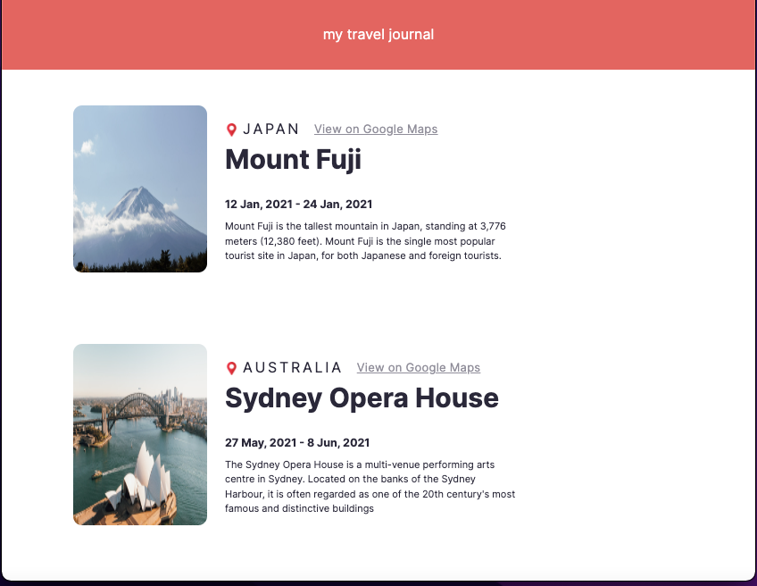

This is my first solo-project i made as part of learning reactjs from scrimba by 
[Bob ziroll](https://github.com/bobziroll)

to get the code 
```link
git clone https://github.com/Sigma2345/my-travel-journal.git
```

to run the code locally
```shell
npm install 
npm start
```

to add more trips , user can add to the data.js file the necessary information


